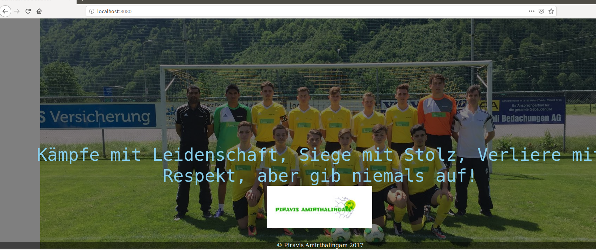

# LB3 Dokumentation
## Container

| Autor | Amirthalingam |
| ------ | ------ |
| Klasse | ST17c|
| Projekt | Apache Webserver |
| Lehrperson | Marco Berger|
| Version | 1.0 |

## Inhaltsverzeichnis

- Einleitung
  - Übersicht des Projektes
  - Vorbereitung
  - Reflexion
  - Quellenverzeichnis


***
## Einleitung

Bei dieser Projektarbeit muss eine Arbeit erstellen, welche auf der Docker Container-Technologie basiert.
Meine Arbeit ist ein Apache-Server, welcher meine eigene Webseite darstellt.

***
# Übersicht des Projektes
    +---------------------------------------------------------------+
    ! Notebook                                                      !                 
    ! Apache-Webserver Port: 8080 (127.0.0.1)                       !	
    !                                                               !	
    !    +-----------------------------------------+                !
    !    ! Virtuelle Maschine                      !                !
    !    ! Web Server (Port:80)                    !                !
    !    +-----------------------------------------+                !
    !                                                               !	
    +---------------------------------------------------------------+

    ***
## Vorbereitung

- Ich habe mein Arbeit auf einem Ubuntu-VM Version 18.04 entwickelt. Am besten benutzen sie auch diese Version, um meiner Anleitung zu folgen.

- Erster Schritt: Mein Repository auf die lokale Festplatte herunterladen und entpacken
```
https://github.com/scorpionkick69/LB3.git
```
- Zweiter Schritt: Starten sie im Apache-Ordner das Terminal und führen sie diesen Befehl aus, um den Docker Container zu builden:
```
docker build -t apache .
```
- Dritter Schritt: Docker Container starten:

```
docker run --rm -d -p 8080:80 -v `pwd`/web:/var/www/html --name apache apache
```

- Vierter Schritt: Im Browser "localhost:8080" eingeben


***
## Reflexion
Dieses plattformübergreifende Dienstmodul war ein spezielles Modul. Vorher kam ich nie mit Container in Kontakt. Ich habe lediglich von Docker und Kubernetes gehört. Dieses Modul am Anfang zu verstehen war recht schwierig, aber nach und nach konnte ich das Modul besser 
verstehen. Leider hindert uns Corona daran, dass wir alle zusammen in einem Klassenraum zusammenlernen können. Für mich war es sehr speziell zuhause Unterricht zu haben. Diese offene Aufgabenstellung hatte für mich mehr Schattenseiten als Sonnenseite. Ich finde es gut, 
dass man sehr viele Projekte selber machen könnte, aber ich hätte viele Projekte gehabt, die ich mache möchte, aber die Entscheidung für ein Projekt war für mich schwierig. Ich habe schlussendlich Apache genommen und und es mit einer Webseite erweitert. Ich bedanke mich 
recht herzlich, dass sie uns dieses interessante Thema etwas näher gebracht haben.
***

## Quellenverzeichnis

https://github.com/mc-b/M300/tree/master/docker/apache


